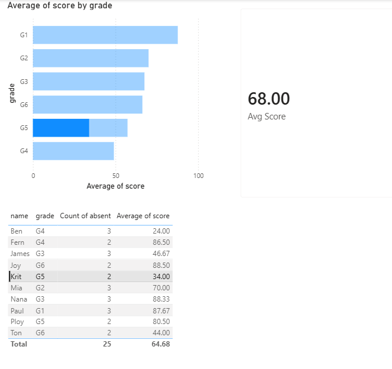

# 📚 Tutoring Center Student Analytics Dashboard

**By Armanee Mardstool | Data Analytics Portfolio Project**

---

## 📌 Project Overview

This project analyzes student performance data from an international tutoring center (K1–G6) to identify learning gaps, absence patterns, and the impact of makeup sessions on student outcomes.

The analysis is based on real operational experience as a Mathematics Instructor, where manual reporting and lack of data tracking created significant inefficiencies.

---

## ❓ Business Problem

> *"How can a tutoring center use data to improve student learning continuity, reduce administrative burden, and deliver better insights to parents?"*

**Key pain points identified:**
1. Teachers spent 15–20 minutes per class manually writing and sending reports to parents
2. Students attending makeup sessions with different teachers showed inconsistent learning progress
3. No system existed to flag at-risk students before they fell too far behind
4. Trial test results were stored in LINE chat, making it difficult for teachers to access prior to lessons

---

## 🎯 Objectives

- Analyze absence patterns by grade level
- Compare scores between regular sessions and makeup sessions
- Identify at-risk students based on absences and performance
- Propose data-driven recommendations to improve center operations

---

## 🗂️ Dataset

Simulated dataset built from real tutoring center experience, structured across 4 tables:

| Table | Description | Rows |
|---|---|---|
| students | Student profiles (name, grade, enrollment date) | 10 |
| sessions | Class records (date, teacher, topic, score, absent) | 25 |
| trial_test | Initial assessment results per student | 10 |
| makeup_tracking | Makeup session records with topic match tracking | 3 |

**Data source:** Simulated based on personal experience as an International Math Instructor (K1–G6)

---

## 🔍 Analysis

### SQL Queries

**1. Absence Rate by Grade**
```sql
SELECT 
    students.grade,
    COUNT(*) AS total_sessions,
    SUM(CASE WHEN sessions.absent = 'Yes' THEN 1 ELSE 0 END) AS total_absences,
    ROUND(SUM(CASE WHEN sessions.absent = 'Yes' THEN 1 ELSE 0 END) * 100.0 / COUNT(*), 2) AS absence_rate
FROM sessions
JOIN students ON sessions.student_id = students.student_id
GROUP BY students.grade
ORDER BY absence_rate DESC;
```

**2. Score Comparison: Regular vs Makeup Sessions**
```sql
SELECT 
    is_makeup,
    COUNT(*) AS total_sessions,
    ROUND(AVG(score), 2) AS avg_score
FROM sessions
WHERE absent = 'No'
GROUP BY is_makeup;
```

**3. At-Risk Student Identification**
```sql
SELECT 
    students.student_id,
    students.name,
    students.grade,
    COUNT(CASE WHEN sessions.absent = 'Yes' THEN 1 END) AS total_absences,
    ROUND(AVG(CASE WHEN sessions.absent = 'No' THEN sessions.score END), 2) AS avg_score
FROM students
JOIN sessions ON students.student_id = sessions.student_id
GROUP BY students.student_id
HAVING total_absences >= 1 OR avg_score < 80
ORDER BY avg_score ASC;
```

---

## 📊 Key Findings

| Finding | Result |
|---|---|
| Grade with highest absence rate | G4 — 40% |
| Avg score: Regular sessions | 83.18 |
| Avg score: Makeup sessions | 67.67 |
| Score gap (Regular vs Makeup) | **15.51 points** |
| At-risk students identified | 5 out of 10 |
| Lowest performing student | Krit (G5) — 34.00 avg |

---

## ❌ What Didn't Work

- Attempted to find correlation between day of week and student scores — no significant pattern found with this dataset size
- Tried to segment by teacher effectiveness — insufficient data points to draw statistically meaningful conclusions

---

## 💡 Business Recommendations

1. **Absence Alert System** — Flag students with 2+ consecutive absences for immediate parent notification
2. **Mandatory Topic Matching for Makeup Sessions** — Makeup teachers must follow the original session topic, not their own curriculum
3. **Standardized Digital Reporting Template** — Replace manual LINE reports with a Google Form template to save ~15–20 minutes per class per teacher
4. **Centralized Trial Test Database** — Move trial test results from LINE chat to a shared spreadsheet accessible to all teachers before lessons

---

## 🛠️ Tools Used

| Tool | Purpose |
|---|---|
| Google Sheets | Dataset creation and data cleaning |
| DB Browser for SQLite | SQL analysis and querying |
| Power BI Desktop | Dashboard and data visualization |

---

## 📈 Dashboard Preview



**Dashboard includes:**
- Average score by grade (Bar Chart)
- Overall average score — 68.00 (Card)
- At-risk student table with absence count and average score

---

## 👩‍💼 About This Project

This project was built as part of my Data Analytics portfolio to demonstrate end-to-end analytical skills — from data collection and SQL querying to dashboard creation and business recommendation.

The business context is drawn from my real experience as an International Mathematics Instructor at a tutoring center in Bangkok, Thailand, giving this analysis practical grounding beyond a typical academic exercise.

**Connect with me on LinkedIn:** [Armanee Mardstool](https://linkedin.com/in/armanee-mardstool)
